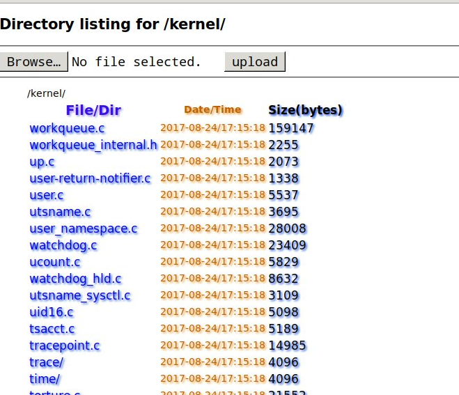

Multi-threaded Python3 HTTP download/upload server.
===================================================

BaseHTTPServer that implements the standard GET and HEAD requests.

This is wide open and meant for trusted environments only.
The purpose is to have an easy way to share files on a LAN with people
you trust.

It works but it's not perfect. But good enough.

Features:
---------

* Forks for each new request
* Can handle multiple requests simultaneously
* Allows file uploads overwriting existing files
* Display directories and files with sizes and date/time
* Serves a favicon no matter what directory it runs from
  just supply the icon and point to it with faviconpath
* Has no dependencies except Python3

Here's what a directory listing looks like:

Portability:
------------

* Runs fine on linux, should run fine on macosx, fork is not supported
  on windows.

TODO:
-----

- On file upload don't overwrite an existing file, sometimes you want to overwrite an existing file,.e.g. An index.html file that prevents seeing a directory's contents. Maybe allow some to be overwritten and deny all others; an overwrite whitelist.

